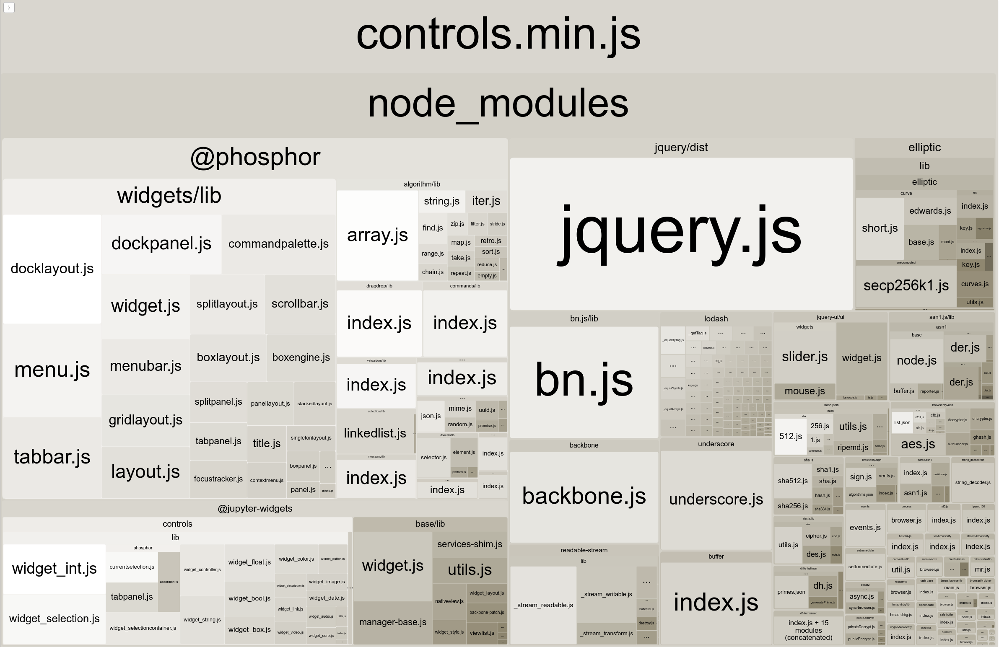

## Background

Jupyter Widgets is a popular library to provide rich kernel-client interactivity
to a Jupyter notebook. The widgets rely on the standard comm channel messages
for kernel to client communication but client implementations diverge.

Google Colaboratory is adding support for ipywidgets and we have a couple of goals:

 1) Users can install and use arbitrary widgets, including upgrading or downgrading versions of pre-installed widgets.
 2) Later viewers of notebooks have a high-fidelity viewing experience, using the same version of widgets as the original author of the notebook.
 3) Widget authors can build widgets that work in multiple notebook frontends.

## Module resolution
The Jupyter Widgets documentation has a good explanation of how widgets work at
a low level.

The client-side lifecycle starts when the browser receives a ‘comm_open’ with a
string identifier (`_model_module`) indicating the JavaScript module which
declares the implementation of that widget. For example in the case of the base
types the module identifier is `@jupyter-widgets/base`.

There is no standard way to resolve that module:

 - Jupyter Notebook relies on extensions having configured the global require.js
   environment to map from these names to the module paths. For example the core
   widgets are declared at:
   https://github.com/jupyter-widgets/ipywidgets/blob/1223d4128aebe6c8831a034a73d1546a91f5138a/widgetsnbextension/src/extension.js#L5

 - Jupyter Lab relies on extensions registering the presence of the widget
   modules as well:
   https://github.com/jupyter-widgets/ipywidgets/blob/1223d4128aebe6c8831a034a73d1546a91f5138a/packages/jupyterlab-manager/src/plugin.ts#L98

This model does not work well for other environments because:

 1) The registration is done via an application-specific extension which is not
    intended to work in other environments.
 2) The registration is expected to occur on application initialization rather
    than dynamically. Users should be able to `!pip install` a widget and use
    it.

### Potential solutions

#### Service API

The kernel manager could provide an endpoint such as /api/widget_modules which returns information about available widget modules:

An `/api/widget_modules` endpoint:
```json
{
  "@jupyter-widgets/base": {
      "module_path": "nbextensions/jupyter-js-widgets/extension",
      "css_path": "nbextensions/jupyter-js-widgets/extension.css"
  },
  "@jupyter-widgets/controls": {
      "module_path": "nbextensions/jupyter-js-widgets/extension",
      "css_path": "nbextensions/jupyter-js-widgets/extension.css"
  },
  "@widget-maker": {
      "module_path": "nbextensions/widget-maker/widgets.js",
      "css_path": "nbextensions/widget-maker/widgets.css"
  }
}
```

This would require a kernel registration mechanism to expose the presence of the
widget along the lines of `jupyter nbextension`.

The `widgets` directory would be served similar to nbextensions as well.

#### Client API
Clients could provide a method exposed to the output of a cell execution which
would register the availability of a widget and allow this information to be
used by subsequent outputs.

```javascript
jupter.widgets.registerModule('@jupyter-widgets/base', {
  modulePath: "nbextensions/jupyter-js-widgets/extension",
};
```

There should be an agreed upon module system for the modules being loaded (CommonJS, AMD, ES6 or similar). In addition, the modules should be able to express dependencies on CSS which it expects to use as well, which would be automatically loaded as part of displaying a view.

## Widget API Surface

Currently the base Widgets classes have a significant set of dependencies where the transitive set is over 800KB minified. This adds significant overhead for rendering simple controls in otherwise clean browser environments such as a sandboxed iframe.

Many of these dependencies are also exposed as part of the public API. As libraries are upgraded, added, and removed, it will be difficult for widget authors and notebook frontends to ensure compatibility given such a large API surface.

The resulting size visualization of [@jupyter-widgets/controls](https://github.com/jupyter-widgets/ipywidgets/tree/master/packages/controls) using [webpack-bundle-analyzer](https://www.npmjs.com/package/webpack-bundle-analyzer) is:




A goal of Colaboratory is self-contained notebooks that can be shared and viewed by multiple users even if later viewers are not connected to a kernel.. In order to accomplish this, Colaboratory offers only an absolute minimum public API then stores all dependent resources in the notebook itself.

This has the following benefits:

 - Users have control over the package versions they want to use and can upgrade or downgrade as needed.
 - Caching the resources in the notebook allow viewing with the same version which was used when the code originally executed.
 - Later viewing of notebooks is not tied to the kernel which created the notebook.

